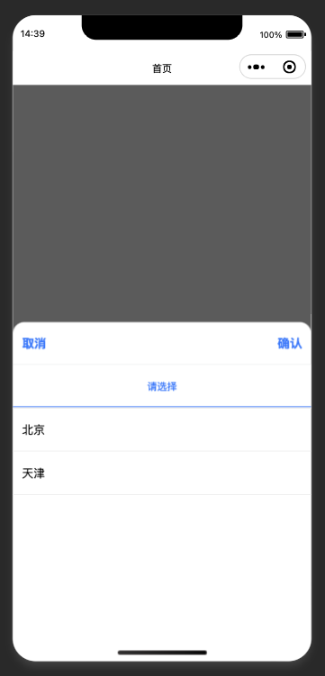

# taro-picker-cascader

基于Taro3、React的H5和微信小程序多端弹窗级联组件



# 安装

```bash
npm install taro-picker-cascader
```

# 导入组件

```js
import Cascader from 'taro-picker-cascader'
```

# 参数说明

## Cascader

| 参数              | 描述           | 类型      | 必传  | 默认值               |


## Events

| 事件名            | 描述                             | 类型       | 必传  | 默认值 |
| -------------- | ------------------------------ | -------- | --- | --- |

# 使用

```js
import Cascader, { CascaderOptions, DataSource, Tab } from 'taro-picker-cascader';

export default function Demo() {
  const options: DataSource[] = [
    {
      label: '北京',
      value: 'beijing',
      children: [
        {
          label: '北京市1',
          value: 'beijing1',
        },
        {
          label: '北京市2',
          value: 'beijing2',
        },
      ],
    },
    {
      label: '天津',
      value: 'tianjin',
      children: [
        {
          label: '天津市1',
          value: 'tianjin1',
        },
      ],
    },
  ]

  const [visible, setVisible] = useState(true)

  const handleConfirm = (ids: string[], tabs: Tab[]) => {}

  return (
    <Cascader visible={visible} onShow={setVisible} options={options} onConfirm={handleConfirm} />
  )
}
```
